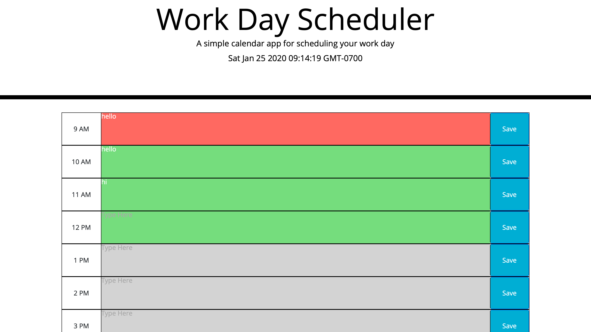

# Project Title
​
## Overview
​
The purpose of this assignment is to have a 9-5 PM work hours planner to save your events or assignments you need to remember.
​
### Gallery
​
Home:

​
### Problem
​
Scope was my biggest issue. I also struggled with the parent and children because I updated my HTML a few times. I got good at it though because of my changes.
​
### Solution
​
My solution will let users be able to save their tasks, events, or assignments they need during the working hours of 9-5 PM.
​
## Tech and Features Used
​
* Bootstrap
* Javascript
* JQuery
​
## How to use
​
Instrunctions on how to use if needed.
​
## Technical Overview
​
1. The main component is the hoursUpdater function where we are able to keep track of the date, time, and hour.
2. That component has a function where we use local storage to keep track of our time of day. That gives automation components to the hour by hour cusotmization.
3. For every text area saved component it saves it to local storage per every hour row.
4. The save button saves it to local storage and you can save until it is deleted.

Link to example readme:
​
https://github.com/jordan-hanson/calendarhomework